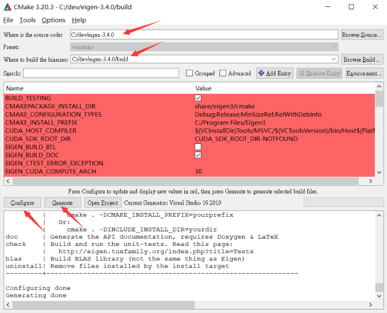

# cmake-eigen
 在windows使用cmake配置eigen

归纳几种方法

- eigen官网 - getting started（https://eigen.tuxfamily.org/dox/GettingStarted.html）

  In fact, the header files in the `Eigen` subdirectory are the only files required to compile programs using [Eigen](https://eigen.tuxfamily.org/dox/namespaceEigen.html). The header files are the same for all platforms. It is not necessary to use CMake or install anything.

  ```
   include_directories(path/to/eigen)
  ```

  即可直接使用

- eigen官网 - **Using Eigen in CMake Projects**(https://eigen.tuxfamily.org/dox/TopicCMakeGuide.html)

  Eigen exports a CMake target called `Eigen3::Eigen` which can be imported using the `find_package` CMake command and used by calling `target_link_libraries` as in the following example:

  ```
  cmake_minimum_required (VERSION 3.0)
  project (myproject)
   
  find_package (Eigen3 3.3 REQUIRED NO_MODULE)
   
  add_executable (example example.cpp)
  target_link_libraries (example Eigen3::Eigen)
  ```

  但是在windows里`find_package` ~~大概肯定~~可能会找不到eigen,需要通过cmake GUI “安装”

  

  然后就可以使用`find_package`了 ~~大概~~

  （没试过是否必须要放在C盘）

